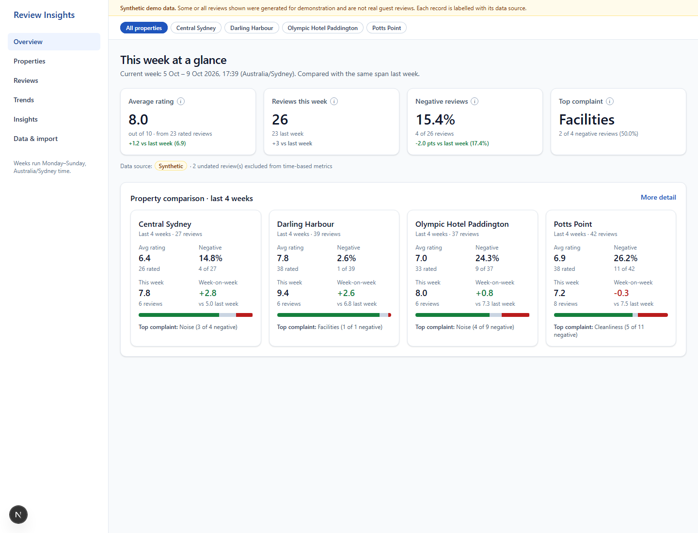
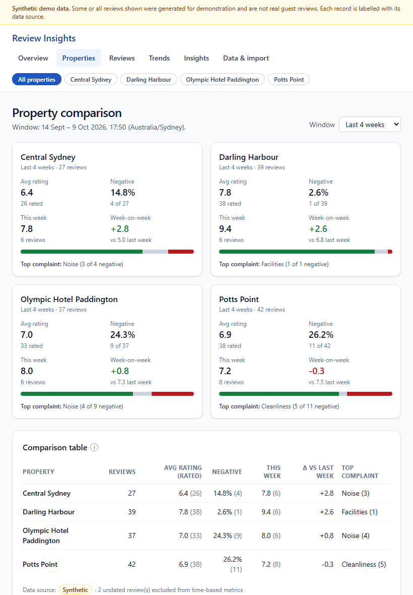
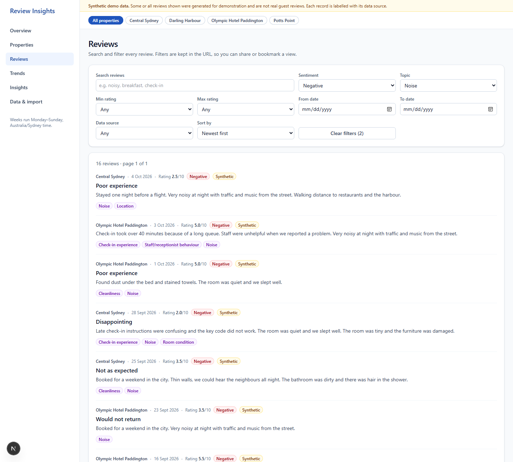
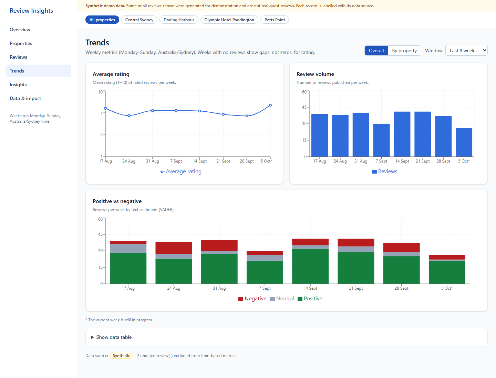
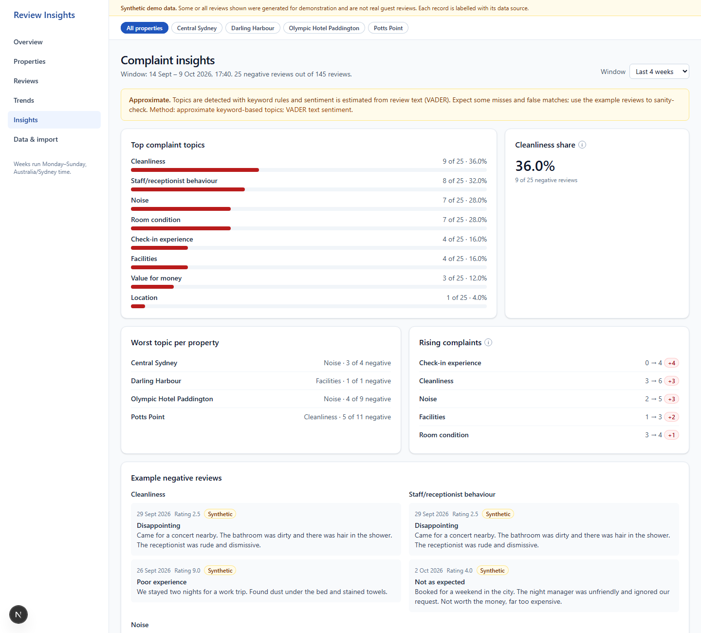
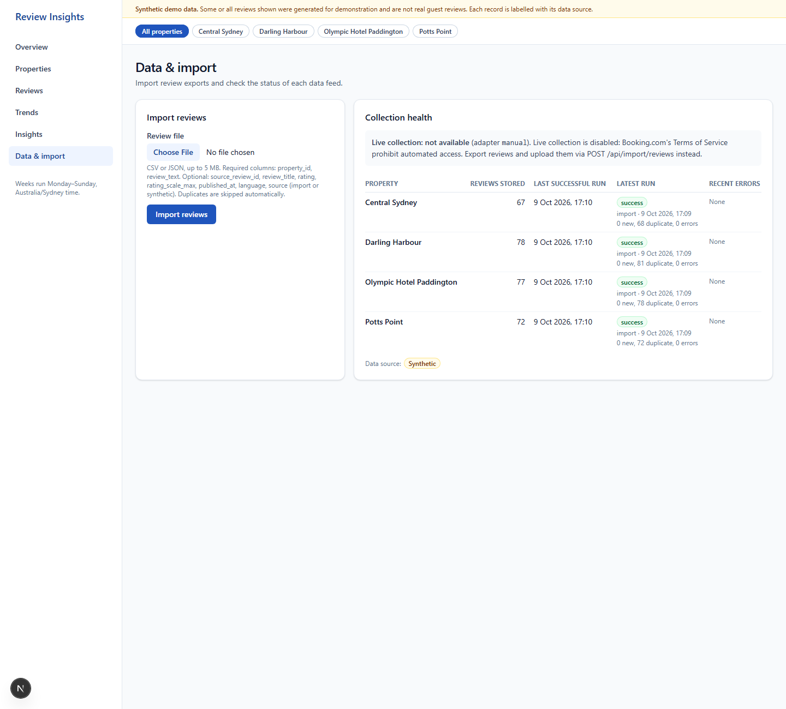
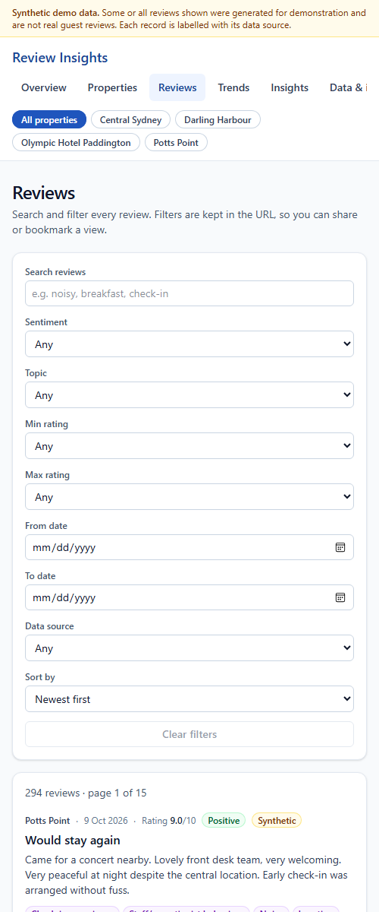

# Review Insights: project walkthrough

This document explains what the project does, how it is built, how data moves through it, and how
to run, test and extend it. It is written for someone new to the codebase.

> **Data notice.** Every review in the database right now is **synthetic** demo data produced by
> `data/generate_sample.py`. Nothing here is a real Booking.com review, and the app says so on
> every page.

---

## 1. What problem it solves

A small hotel group runs four Sydney properties and wants to know, week by week:

- How guests rate each property this week compared with last week.
- How many reviews came in, and what share were negative.
- What guests complain about (cleanliness, noise, check-in, …), and which complaints are growing.
- Whether the data feeding the dashboard is healthy: when it last arrived and whether anything
  failed.

| Property id | Display name |
| --- | --- |
| `olympic-paddington` | Olympic Hotel Paddington |
| `venus-potts-point-sydney` | Potts Point |
| `venus-surry-hills` | Central Sydney |
| `chateau-de-venus` | Darling Harbour |

---

## 2. The big decision: no scraping

Before writing any collector, Booking.com's `robots.txt` and Terms of Service were reviewed
(details in [`COLLECTION.md`](COLLECTION.md)). Section A15.2 of the Terms prohibits automated
access to the site. As a result:

- **There is no scraper**, and nothing tries to get around CAPTCHAs, logins or anti-bot measures.
- The supported way to get reviews in is **file import** (CSV or JSON), through the API or the UI.
- A pluggable `CollectorAdapter` interface still exists, with retries, backoff, rate limiting and
  run logging, so a permitted source (for example an official partner API) could be added later
  without changing anything else. The only adapter shipped is `ManualAdapter`, and
  `POST /api/collection/run/{property_id}` returns **501 `collection_unsupported`** with the reason.

---

## 3. Architecture at a glance

```
┌──────────────────────────────┐        ┌───────────────────────────────────────────┐
│  Next.js 16 (App Router)     │  /api  │  FastAPI backend (Python 3.12)            │
│  frontend/                   │ ─────▶ │  backend/app                              │
│  • 6 routes, client views    │ proxy  │  ├─ api/        routes, schemas, errors   │
│  • SWR data hooks            │        │  ├─ services/   normalize, importer,      │
│  • URL-synced filters        │        │  │              classify, sentiment,       │
│  • Recharts charts           │        │  │              analytics, collection      │
└──────────────────────────────┘        │  ├─ models.py   SQLAlchemy 2.x ORM        │
                                        │  └─ db.py       engine tuned for Neon     │
                                        └─────────────────────┬─────────────────────┘
                                                              │ psycopg 3
                                                              ▼
                                        ┌───────────────────────────────────────────┐
                                        │  Neon serverless Postgres                 │
                                        │  • main DB  (DATABASE_URL, pooled)        │
                                        │  • migrations (DIRECT_DATABASE_URL)       │
                                        │  • booking_test (TEST_DATABASE_URL)       │
                                        └───────────────────────────────────────────┘
```

It is a **modular monolith**: one backend process and one frontend process, with no
microservices, no Redis, no message queue and no paid APIs. Each layer has a single job:

| Layer | Where | Responsibility |
| --- | --- | --- |
| Collection / import | `services/importer.py`, `services/collection.py` | Get reviews in safely and idempotently, and log every run |
| Normalisation | `services/normalize.py` | Clean text, parse dates and ratings, compute content hashes |
| Enrichment | `services/classify.py`, `services/sentiment.py`, `services/processing.py` | Topic labels and text sentiment |
| Persistence | `models.py`, `alembic/` | Schema, constraints and deduplication at the database level |
| Analytics | `services/analytics.py` | Weekly KPIs, comparisons, trends and topic insights, all in SQL |
| API | `api/` | Validated HTTP endpoints, one error format, provenance on every response |
| UI | `frontend/` | Dashboard, review feed, charts, import and health |

---

## 4. Repository tour

```
booking.com/
├─ .env.example            Sanitised config template (the real .env is gitignored)
├─ Makefile                make setup | migrate | import-sample | backend | frontend | test | lint | build | check
├─ scripts/tasks.ps1       The same tasks for Windows PowerShell
├─ data/
│  ├─ generate_sample.py   Deterministic synthetic data generator (seed 42)
│  ├─ sample_reviews.csv   299 rows (5 deliberate duplicates), all labelled synthetic
│  ├─ sample_reviews.json  Same data; top-level "notice": "SYNTHETIC DATA..."
│  └─ README.md
├─ docs/
│  ├─ ARCHITECTURE.md      Decisions and assumptions
│  ├─ COLLECTION.md        robots.txt/ToS findings, adapter design, failure handling
│  ├─ CLASSIFICATION.md    Topic keyword lists, sentiment thresholds, content-hash formula
│  ├─ API.md               Every endpoint, with real captured request/response examples
│  ├─ WALKTHROUGH.md       This file
│  └─ screenshots/         Dashboard screenshots taken from the running app
├─ backend/
│  ├─ pyproject.toml       Dependencies (managed with uv), ruff and mypy config
│  ├─ alembic/             Migrations (0001_initial.py)
│  ├─ app/
│  │  ├─ config.py         Settings from env (pydantic-settings)
│  │  ├─ db.py             Engine factory, UTCDateTime type, sessions
│  │  ├─ models.py         Property, Review, CollectionRun
│  │  ├─ seed.py           The 4 properties
│  │  ├─ migrate.py        Programmatic upgrade/downgrade (used by CLI and tests)
│  │  ├─ cli.py            python -m app.cli migrate | import | reclassify
│  │  ├─ main.py           create_app(): CORS, error handlers, router
│  │  ├─ api/              routes.py, schemas.py, errors.py
│  │  └─ services/         normalize, importer, collection, classify, sentiment, processing, analytics
│  └─ tests/               pytest suite and fixtures (separate from the sample data)
└─ frontend/
   ├─ next.config.ts       Cache Components, and a rewrite of /api/* to the backend
   ├─ vitest.config.mts    jsdom and React Testing Library setup
   └─ src/
      ├─ app/              Routes: / properties reviews trends insights data, plus loading/error/not-found
      ├─ views/            One client view per route (and its tests)
      ├─ components/       App shell, nav, property filter, KPI cards, comparison, UI primitives
      ├─ lib/              types.ts, api.ts, hooks.ts, url-state.ts, format.ts
      └─ test/             setup, mocks, fixtures
```

---

## 5. The database (Neon Postgres)

### 5.1 Why there are three connection strings

| Variable | Used by | Why |
| --- | --- | --- |
| `DATABASE_URL` | The running app | Neon's **pooled** endpoint (pgbouncer in transaction mode) handles many short connections cheaply |
| `DIRECT_DATABASE_URL` | Alembic migrations | DDL and migration locks need a real, non-pooled session |
| `TEST_DATABASE_URL` | pytest | A **separate** database (`booking_test`). The suite refuses to run if it points at the main DB |

All three live only in `.env`, which is gitignored and has never been committed.

`db.make_engine()` adjusts the engine for serverless Postgres:

- `prepare_threshold=None` on pooled hosts, because pgbouncer transaction mode breaks server-side
  prepared statements.
- `pool_pre_ping=True` and `pool_recycle=240`. Neon closes idle connections, so stale ones are
  detected and replaced instead of failing a request.
- A small pool (5, plus 5 overflow).
- A connect retry, to absorb Neon's cold-start delay after it scales to zero.

### 5.2 Tables

**`properties`**: `id` (stable string), `name`, `source_url`, `created_at`, `updated_at`.

**`reviews`**

| Column | Notes |
| --- | --- |
| `property_id` | FK to `properties` |
| `source_review_id` | Nullable. External id when one exists (synthetic rows use `SYNTH-<property>-<n>`) |
| `review_title`, `review_text` | Whitespace-normalised |
| `rating` | Nullable, normalised to **1–10**, with a CHECK constraint. A missing rating stays NULL and is never stored as 0 |
| `published_at` | `timestamptz`, nullable. Undated reviews are kept but excluded from time-based metrics, and the count is reported |
| `language` | Nullable |
| `sentiment_label`, `sentiment_score` | CHECK on positive, neutral or negative |
| `topic_labels` | **JSONB array**, GIN-indexed, with a CHECK that it is an array |
| `source` | CHECK on `live`, `import` or `synthetic` |
| `content_hash` | SHA-256 fallback identity used for deduplication |
| `collected_at`, `created_at`, `updated_at` | `timestamptz` |

**`collection_runs`**: one row per property per import or collection attempt. Holds `adapter`,
`started_at`, `finished_at`, `status` (running, success, partial or failed),
`discovered_count`, `inserted_count`, `duplicate_count`, `error_count`, and `error_summary`
(sanitised, with no secrets or stack traces).

### 5.3 Deduplication is enforced by the database

Duplicates are rejected by unique indexes, not just by application code:

1. A **partial unique index** on `(property_id, source_review_id) WHERE source_review_id IS NOT NULL`.
2. A **unique index** on `(property_id, content_hash)` for rows without an external id.

Inserts use `INSERT … ON CONFLICT DO NOTHING RETURNING …` in batches of 500. Importing the same
file twice, or two imports running at once, cannot create duplicates. The `RETURNING` clause
tells us exactly how many rows were new and how many were duplicates.

All timestamps are `timestamptz`. The custom `UTCDateTime` type rejects naive datetimes in Python
and always returns UTC, so timezone bugs show up early instead of silently.

---

## 6. Getting data in: the import pipeline

```
file ──▶ _parse_rows ──▶ normalize_row ──▶ enrich ──▶ insert_reviews ──▶ CollectionRun per property
         (type, size,      (dates, ratings,   (topics,    (ON CONFLICT
          encoding,         text, hash,        sentiment)  DO NOTHING)
          structure,        validation)
          row limit)
```

1. **File-level checks**: the extension must be `.csv` or `.json`; size must be at most
   `IMPORT_MAX_BYTES` (5 MB by default) and rows at most `IMPORT_MAX_ROWS` (50,000); the file must
   be UTF-8 and have a valid structure. Failures map to HTTP 415, 413 or 400.
2. **Row-level normalisation** (`normalize.py`):
   - Dates are parsed as ISO 8601 first, then common formats (day-first unless the string starts
     with a year). Naive times are taken to be Sydney time and stored as UTC. Dates more than a day
     in the future, or before 2000, are rejected.
   - Ratings are validated and converted from other scales; for example `rating_scale_max: 5` maps
     to 1–10.
   - Text is whitespace-normalised. Blank optional fields become NULL.
3. **A bad row never aborts the import.** Each invalid row is reported with its row number, field
   and message, and the valid rows are still inserted.
4. **Provenance is enforced.** `source` may be `import` or `synthetic`. A row flagged
   `is_synthetic`, or with an id starting `SYNTH-`, is always stored as synthetic. `live` is
   rejected for imports because it is reserved for a real collector.
5. **Enrichment** adds topic labels and sentiment before insert.
6. **Run logging**: a `running` CollectionRun is committed first, then completed as `success`,
   `partial` (some invalid rows) or `failed`. A failed run never deletes existing reviews.

The result returned to the caller and shown in the UI is `discovered / inserted / duplicates /
invalid`, plus a per-property run summary.

**Real result from the clean-checkout run today:** re-importing `sample_reviews.csv` into a
database that already had it inserted **0** rows and reported every row as a duplicate (for
example, run 13: 68 discovered, 0 inserted, 68 duplicates). This shows the import is idempotent.

---

## 7. Topics and sentiment

### 7.1 Topics: rule-based, deliberately simple

`RuleBasedTopicClassifier` (name `rules-v1`) assigns zero or more of eight topics using
word-boundary regular expressions:

`Cleanliness` · `Check-in experience` · `Staff/receptionist behaviour` · `Noise` ·
`Facilities` · `Location` · `Room condition` · `Value for money`

- It is multi-label: one review can mention noise, cleanliness and check-in at once.
- Word boundaries prevent false matches inside other words.
- It handles basic negation.
- It runs on `"title. text"`.
- It sits behind a `TopicClassifier` protocol, so an ML model could replace it without touching
  callers.
- The keyword lists are documented in [`CLASSIFICATION.md`](CLASSIFICATION.md).

The UI labels topic results **"Approximate"**, because keyword rules miss paraphrases and
sometimes over-match.

### 7.2 Sentiment: VADER, run locally

- Compound score ≥ 0.05 is **positive**, ≤ −0.05 is **negative**, and anything in between is
  **neutral**.
- Empty or non-English text is **neutral** with a NULL score. We don't pretend VADER understands
  French.
- **Sentiment and rating are kept separate on purpose.** A guest can write "Very noisy at night"
  and still give 5/10, or write mild text and give 2/10. The dashboard shows both and never derives
  one from the other.
- No accuracy figures or confidence numbers are claimed.

After changing the rules, `python -m app.cli reclassify` re-enriches every stored review.

---

## 8. Analytics: how the numbers are defined

All aggregation runs in **Postgres SQL**, not in Python loops.

### 8.1 What counts as a "week"

- A week starts **Monday 00:00 Australia/Sydney** (`BUSINESS_TIMEZONE`). Daylight-saving changes
  are handled, because boundaries are computed with `zoneinfo` in the business timezone and then
  converted to UTC.
- **Current week** runs from Monday 00:00 to *now*.
- **Previous week** is the *same elapsed span* one week earlier. On a Friday at 17:39 we compare
  Monday 00:00–Friday 17:39 with last Monday 00:00–last Friday 17:39. A partial week is never
  compared against a full one.
- KPI periods are computed in Python and passed to SQL as bound parameters. Trend buckets use
  `date_trunc('week', timezone(tz, published_at))`.
- Every analytics endpoint accepts `as_of`, so any past moment can be reproduced exactly. Tests
  rely on this.

### 8.2 The rules every metric follows

- **Missing rating ≠ 0.** Averages use only rated reviews, and the API returns `rated_reviews` as
  the denominator.
- **Missing date means excluded.** Undated reviews are left out of time-based metrics and counted
  in `excluded_undated`.
- **Divide-by-zero becomes `null`, never 0.** With no reviews, `% negative` is `null` and the UI
  shows **N/A**.
- No significance testing and no causal claims.

### 8.3 What is computed

| Function | Endpoint | Contents |
| --- | --- | --- |
| `summary` | `/api/analytics/summary` | Average rating this week and last, week-on-week change, review counts, % negative, top negative topic with its denominator |
| `property_comparison` | `/api/analytics/properties` | Per property over an N-week window: rating, volume, positive/neutral/negative split, week-on-week change, most common complaint |
| `trends` | `/api/analytics/trends` | Weekly average rating, volume and sentiment counts, overall and per property; the current partial week is flagged |
| `topic_insights` | `/api/analytics/topics` | Top topics in negative reviews; % of negatives mentioning cleanliness (with sample size, `null` when there are no negatives); worst topic per property; **rising topics** (last 14 days vs the prior 14, at least 2 recent mentions); example reviews |

Topic counts expand the JSONB array with `jsonb_array_elements_text`. Ties are broken by the fixed
topic order, so results are deterministic.

---

## 9. The API

The full reference with real captured examples is in [`API.md`](API.md). In summary:

| Method | Path | Purpose |
| --- | --- | --- |
| GET | `/api/health` | Liveness and database check |
| GET | `/api/properties` | The 4 properties with review counts |
| GET | `/api/reviews` | Filtered, sorted, paginated feed |
| GET | `/api/reviews/{id}` | One review (404 if missing) |
| GET | `/api/analytics/summary` · `/properties` · `/trends` · `/topics` | Analytics (accept `property_ids`, `as_of`, and `weeks` where relevant) |
| GET | `/api/collection/runs` · `/api/collection/health` | Run history and per-property health |
| POST | `/api/collection/run/{property_id}` | 404 for an unknown property, **501** because live collection is unsupported |
| POST | `/api/import/reviews` | Multipart file upload |

`/api/reviews` filters:

- `property_ids` (repeated, or comma-separated).
- `date_from` / `date_to` (business-timezone calendar dates, inclusive).
- `rating_min` / `rating_max`, `sentiment`, `topic`, `data_source`.
- `q`: search over title and text, with LIKE wildcards escaped.
- `sort`: `newest`, `oldest` or `rating`.
- `page` / `page_size`, capped by `API_MAX_PAGE_SIZE`.

All filters combine in one SQL query, and the response includes `total`, `total_pages` and the
filters that were applied.

Every error uses the same shape, and none includes a stack trace or config value:

```json
{ "error": { "code": "validation_error", "message": "...", "details": [{ "field": "page_size", "message": "maximum is 100" }] } }
```

Every data response also carries **provenance**: `data_sources` (`live`, `imported`,
`synthetic`) and `contains_synthetic`. This is what drives the synthetic-data banner in the UI.

---

## 10. The frontend

### 10.1 Stack and rendering model

- Next.js **16.4** (App Router) with **Cache Components** on, TypeScript, Tailwind v4, Recharts 3,
  SWR, Vitest and React Testing Library.
- Each `page.tsx` is a small server component that renders a client "view" inside `<Suspense>`.
  This is required because the views read `useSearchParams()`. It also lets every route prerender
  as a static shell that fetches its data in the browser.
- `next.config.ts` rewrites `/api/*` to the FastAPI backend (`BACKEND_URL`), so the browser stays
  on the same origin and there are no CORS problems in development. No backend logic is duplicated
  in Next.js.
- Dates are always formatted with locale `en-AU` and timezone `Australia/Sydney`. Server and
  client therefore produce identical strings, and there are no hydration mismatches.

### 10.2 Key frontend modules

| File | Role |
| --- | --- |
| `lib/types.ts` | TypeScript mirror of the backend Pydantic schemas |
| `lib/api.ts` | Typed `fetch` client; turns the error envelope into an `ApiError` and adds a clear "Could not reach the API" message for network failures |
| `lib/hooks.ts` | One SWR hook per endpoint (`keepPreviousData`, so filters don't flash empty) |
| `lib/url-state.ts` | Filter state **lives in the URL**. `properties` and `as_of` are global and carried across navigation |
| `lib/format.ts` | Formatting for ratings, percentages, signed deltas, dates and N/A |
| `components/ui.tsx` | Card, Skeleton, ErrorState (with Retry), EmptyState, InfoTip (an accessible tooltip), badges |

### 10.3 Page by page

**Overview (`/`)**: four KPI cards (average rating, reviews this week, % negative, top
complaint). Each card shows its **denominator** (for example "from 23 rated reviews" or "4 of 26
reviews"), the **comparison with last week**, and an ⓘ tooltip that explains how it is
calculated. Below the cards is a side-by-side comparison of the four properties.



**Properties (`/properties`)**: comparison cards plus an accessible table, with a 1–12 week window
selector stored in the URL as `?weeks=`.



**Reviews (`/reviews`)**:

- Search is debounced by 300 ms.
- Filters cover sentiment, topic, rating range, date range and data source, with three sort
  options.
- Pagination is stored in the URL, so filters survive paging, refresh and sharing a link.
- **Clear filters** shows how many filters are active. It resets the review filters but keeps the
  property selection.
- Changing any filter returns to page 1.
- Each review shows its property, date, rating, sentiment, data source and topic chips.



**Trends (`/trends`)**:

- Three charts: weekly average rating, review volume, and a positive/neutral/negative split.
- They can be shown overall or **by property**, over a window of 4–52 weeks.
- Weeks without ratings show as gaps, not zeros. The in-progress week is marked with `*`.
- A "Show data table" section gives a text alternative to the charts.



**Insights (`/insights`)**:

- An **"Approximate"** banner explains the method.
- Sections: top complaint topics, cleanliness share (with sample size, or N/A), worst topic per
  property, rising complaints, and example negative reviews to sanity-check against.



**Data & import (`/data`)**:

- The **import form** checks file type and size in the browser before uploading. It then shows the
  rows read, inserted, duplicates skipped, invalid rows, and the first row errors.
- The **collection health** table shows, for each property: last successful run, latest run status
  and adapter, new, duplicate and error counts, recent errors, and why live collection is
  disabled.



**On every page**:

- An amber **"Synthetic demo data"** banner appears whenever the API reports `contains_synthetic`.
- A global property filter sits at the top.
- Each section has a loading skeleton, an empty state, and an error state with **Retry**.
- `loading.tsx`, `error.tsx` (using Next 16's `retry()`) and `not-found.tsx` cover route-level
  cases.

### 10.4 Accessibility and responsiveness

- A skip-to-content link and a visible `:focus-visible` outline.
- `aria-current` on the active navigation item and `aria-pressed` on toggle chips.
- Labelled form controls, table captions and `scope` attributes.
- Tooltips open on keyboard focus and close with Escape.
- Charts have an `aria-label` and a data-table alternative.
- Low-contrast grey text was darkened to meet WCAG AA, and screen-reader-only `h2` headings fix the
  heading order. Both problems were found by an automated **axe-core** test that runs over every
  view.
- On mobile the sidebar becomes a horizontally scrolling top nav and cards stack. The screenshot
  below was taken at about 500 px, because headless Edge cannot render narrower:



---

## 11. Running it

### 11.1 Prerequisites

- Python 3.12 and [uv](https://docs.astral.sh/uv/)
- Node.js 22+ and npm
- A free [Neon](https://neon.tech) project

### 11.2 Neon setup

1. Create a Neon project (any region).
2. On the dashboard, open **Connect**. Copy the **pooled** connection string (host contains
   `-pooler`) into `DATABASE_URL`, and the **direct** one into `DIRECT_DATABASE_URL`. Keep
   `sslmode=require`.
3. Create a second database (for example `booking_test`) or a Neon branch for tests, and put its
   URL in `TEST_DATABASE_URL`.

### 11.3 Commands

On Windows, run `./scripts/tasks.ps1 <task>`. On macOS or Linux, run `make <task>`.

```powershell
Copy-Item .env.example .env              # then fill in the three Neon URLs
./scripts/tasks.ps1 setup                # uv sync, npm install, migrate + seed the 4 properties
./scripts/tasks.ps1 import-sample        # load data/sample_reviews.csv as synthetic
./scripts/tasks.ps1 backend              # terminal 1 → http://127.0.0.1:8000  (OpenAPI at /docs)
./scripts/tasks.ps1 frontend             # terminal 2 → http://localhost:3000
```

Quality gates:

```powershell
./scripts/tasks.ps1 test                 # pytest (against TEST_DATABASE_URL) + vitest
./scripts/tasks.ps1 lint                 # ruff check, ruff format --check, mypy, eslint, tsc
./scripts/tasks.ps1 build                # next build
./scripts/tasks.ps1 check                # all of the above
```

Other useful commands, run from `backend/`:

```powershell
uv run python -m app.cli import path\to\export.csv              # real export → source=import
uv run python -m app.cli reclassify                             # re-run topics + sentiment
uv run python ..\data\generate_sample.py --anchor 2026-10-09T12:00:00+11:00   # regenerate sample
```

---

## 12. Testing strategy and real results

### 12.1 Backend: pytest against a real Postgres

The backend tests run on the separate Neon test database, not SQLite, so JSONB, partial indexes,
`ON CONFLICT` and timezone behaviour are tested for real.

- The session fixture migrates **down to base and back up to head**, which proves the migrations
  can rebuild the schema from scratch.
- Each test runs inside a transaction (using savepoints) that is rolled back afterwards, so tests
  are isolated and fast.
- Concurrency tests use real commits through a separate session factory, followed by a TRUNCATE.

| File | Tests | Covers |
| --- | --- | --- |
| `test_models.py` | 19 | Constraints, FKs, dedup indexes, timestamptz |
| `test_sample_data.py` | 4 | Generator determinism; every row labelled synthetic |
| `test_normalize.py` | 37 | Dates, timezones, rating scales, text, hashes |
| `test_importer.py` | 21 | Idempotency, malformed and oversized files, bad rows, concurrent import |
| `test_collection.py` | 13 | Retry success and exhaustion, partial failure, zero-new = success, no data loss |
| `test_classification.py` | 30 | Each topic, multi-topic, negation, empty text, non-English, rating/sentiment disagreement |
| `test_analytics.py` | 21 | Week boundaries, DST, missing ratings and dates, empty data, zero negatives |
| `test_api.py` | 39 | Filter combinations, pagination, sort, 422 format, 404, upload validation |
| **Total** | **184** | All passed in the development workspace |

### 12.2 Frontend: Vitest and React Testing Library (35 tests, all passing)

| File | Covers |
| --- | --- |
| `lib/lib.test.ts` | Formatters (N/A, signs, Sydney dates), URL merging, global-param links, query building |
| `components/kpi.test.tsx` | Denominators, **N/A KPI handling**, keyboard-accessible tooltips |
| `views/reviews.test.tsx` | **Loading**, **empty**, **error + retry**, **filter reset**, filter change resets page, **pagination preserving filters**, debounced search |
| `views/overview.test.tsx` | KPIs and comparison, N/A cells, independent retry, network-failure message |
| `views/data.test.tsx` | Client-side file checks, **import success counts**, server rejection message |
| `views/a11y.test.tsx` | axe-core on all 6 views and the shell, insights unavailable state, property filter URL sync |

### 12.3 Other checks (verified)

- `ruff check`, `ruff format --check` and `mypy` (20 source files) all pass.
- `eslint --max-warnings=0` and `tsc --noEmit` pass.
- `next build` succeeds, and all 7 routes prerender as static shells.
- The production server (`next start`) served all six pages against the real backend and Neon
  database, which is how the screenshots above were captured.
- **Clean-checkout run:** the repo was cloned to a separate folder, and `setup` and
  `import-sample` worked as documented. That run also found a real bug:
  `tsc` failed on a fresh clone because Next's generated route types (`LayoutProps`) didn't exist
  yet. The fix was to change the `typecheck` script to `next typegen && tsc --noEmit`
  (commit `d32f919`). The full `check` re-run in the clone was stopped before it finished, so this
  document does not claim a complete clean-clone pass after that fix.
- `npm audit --omit=dev` reports **0 vulnerabilities** in production dependencies. The 5
  high-severity advisories npm prints come from dev-only tooling.

---

## 13. Known limitations

- **No live collection.** This is by design, because of Booking.com's Terms. Data must be
  exported and imported.
- **Synthetic data only so far.** All numbers in the screenshots describe generated reviews, not
  real guests.
- **Topics are keyword-based.** They miss paraphrases and sarcasm and can over-match. They are
  labelled approximate, and the example reviews are there to check against.
- **VADER is English-only.** Non-English reviews are neutral with no score.
- **Sentiment can disagree with rating.** This is expected and shown honestly, not "fixed".
- **Rising topics are a simple 14-day vs 14-day count comparison**, not a statistical test.
- **No authentication.** The app is assumed to run as an internal tool. Add auth before exposing
  it publicly.
- **Neon cold starts** can make the first request after idle take a few seconds. The engine
  retries the connection.
- `NEXT_PUBLIC_IMPORT_MAX_BYTES` (frontend) must be kept equal to `IMPORT_MAX_BYTES` (backend) by
  hand.

---

## 14. Extending it

- **Add a permitted data source:** implement `CollectorAdapter.fetch()` in
  `services/collection.py`, register it in `ADAPTERS`, and the existing retry, backoff, rate-limit
  and run-logging code handles the rest. Rows are stored with `source="live"`.
- **Better topics:** implement the `TopicClassifier` protocol (for example an embedding model),
  swap `default_classifier`, then run `python -m app.cli reclassify`.
- **New metric:** add a SQL aggregation to `services/analytics.py`, a schema in `api/schemas.py`,
  a route, a type in `frontend/src/lib/types.ts`, and a hook in `hooks.ts`.
